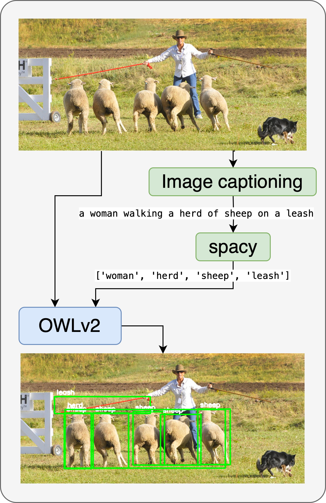
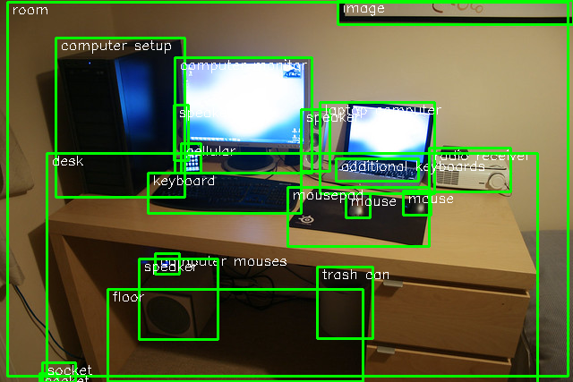
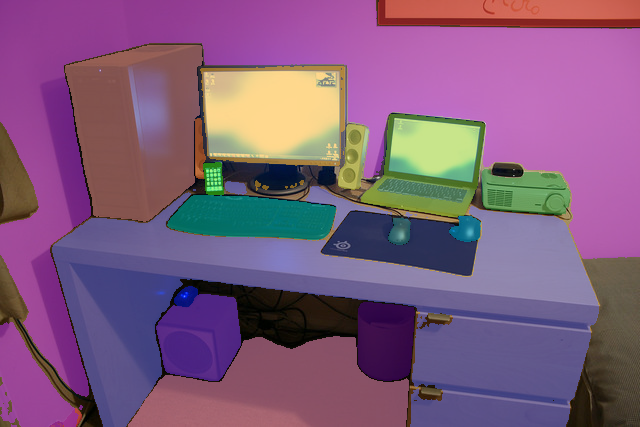

# Detect Everything: Universal Object Detection

Using open-vocabulary detection model and fine-tuned text decoder, detect everything model is created. It's goal is to automatically without user input detect and give label to as much objects in the scene as possible. 

Part of the code is derived from [clip-text-decoder](https://github.com/fkodom/clip-text-decoder). 

## Installation

1. Create new Conda environment
2. Intall of requirements of [clip-text-decoder](https://github.com/fkodom/clip-text-decoder)
3. Upgrade transformers package: `pip install --upgrade transformers`
4. Install [LVIS tools](https://github.com/lvis-dataset/lvis-api)

## Datasets

1. Download [LVIS dataset](https://www.lvisdataset.org) (COCO images can be used instead, it's just different splits)
2. Use `process.py` to precompute embeddings from images
3. Longer and detailed captions obtained from [Hugging Face](https://huggingface.co/datasets/laion/220k-GPT4Vision-captions-from-LIVIS)

## Training

Use `train.py` inside `clip-text-decoder` to train models. For baselines batch size 10 was used. For our model batch size 1 is used as each image has different number of objects and thus different number of embeddings. 

## Models

We trained five models in this project:

1. Baseline with BLIP as image captioner
2. Baseline+ with BLIP as image encoder and GPT2 as text decoder
3. Baseline+ LC trained on longer captions
4. Ours with OWLv2 image encoder and detector and GPT2 text decoder
5. Ours LC trained on longer captions

 

 

Look to the notebooks `test_prediction.ipynb` and `test_segmentation` for example to how do inference and testing

## Segment Everything

We also show how out approach is easily extended to segmentation by using Segment Anything model from [Ultralytics](https://docs.ultralytics.com/models/sam/)

## Examples 

Detect Everything

Segment Everything
